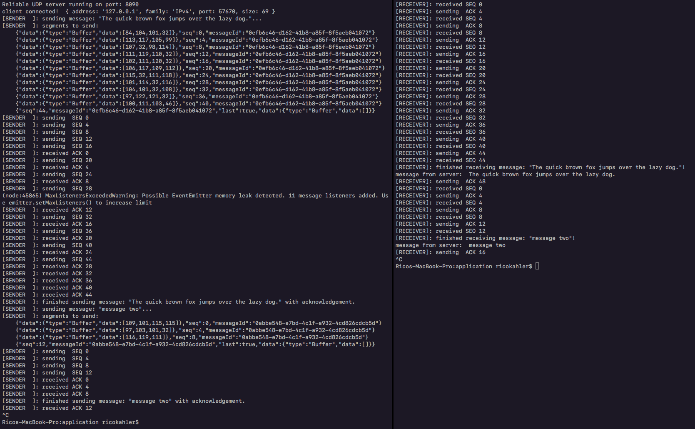

# Install

This example uses node.js as the vm to run the files. [Install the latest version of node.js from here](https://nodejs.org/en/download/current/) then run the following commands to install global dependencies:

    npm install -g ts-node

To get the project running, first clone this repo, `cd` into it, and install the dependencies:

    git clone https://github.com/ricokahler/cis427-p2-kahler-rico
    cd cis427-p2-kahler-rico
    npm install

Then to run the example, starts the server by running this command:

    ts-node ./src/application/server-example.ts

Then in a separate terminal or command prompt, start the client by running this command:

    ts-node ./src/application/client-example.ts

You should get screens like the following:

# Screenshots



# Usage

This project was split into two layers:

1. application
2. reliable-udp

The application modules are separate from the reliable-udp modules. The rudp modules are exposed via the following interfaces:

```ts
interface ReliableUdpServer {
  connectionStream: Observable<ReliableUdpSocket>,
  close(): void
}
```

```ts
interface ReliableUdpSocket {
  info: Udp.AddressInfo,
  messageStream: Observable<Buffer>,
  sendMessage: (message: string | Buffer) => Promise<void>,
}
```

And are used like so:

## Server usage

```ts
// represents a `server` object created from a rudp factory function.
const server = /* rudp server factory */;

server.connectionStream.subscribe((clientConnection: ReliableUdpSocket) => {
  // every time a new connection comes in, this code section will run
  // the type of `clientConnection` will be of the type `ReliableUdpSocket`

  console.log(clientConnection.info); // prints the connection info of the client
  clientConnection.messageStream.subscribe(messageFromClient => {
    // prints messages sent from the client to the server
    console.log('MESSAGE FROM CLIENT: ', messageFromClient);
  });

  // send a message to the client from the server
  clientConnection.sendMessage('this message was/is being sent from the server to the client');
});
```

## Client usage

```ts
// represents a `client` object created form a rudp factory function.
const client = /* rudp client factory */;

client.messageStream.subscribe(messageFromServer => {
  console.log('MESSAGE FROM SERVER: ', messageFromServer);
});

client.sendMessage('this message was/is being send from the client to the server');
```
