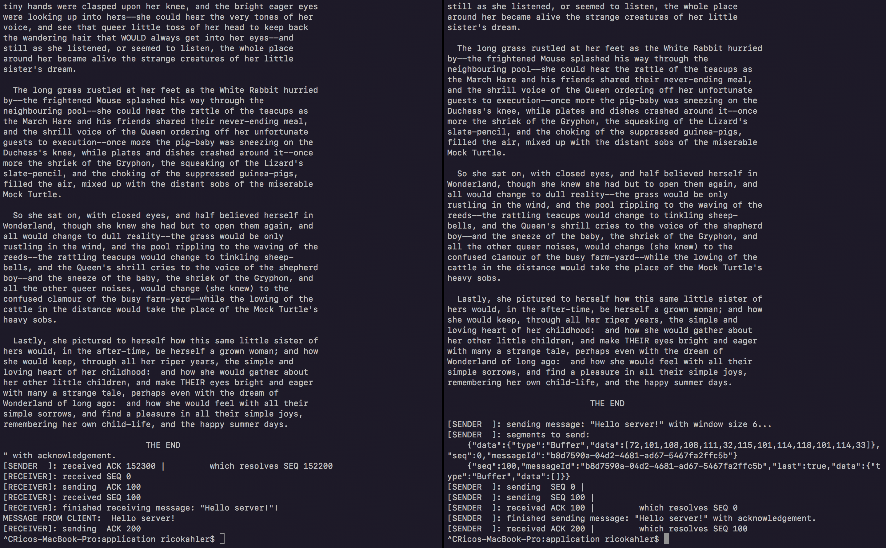

# Install

This example uses node.js as the vm to run the files. [Install the latest version of node.js from here](https://nodejs.org/en/download/current/) then run the following commands to install global dependencies:

    npm install -g ts-node

To get the project running, first clone this repo, `cd` into it, and install the dependencies:

    git clone https://github.com/ricokahler/cis427-p2-kahler-rico
    cd cis427-p2-kahler-rico
    npm install

Then to run the example, starts the server by running this command:

    ts-node ./src/application/server-example.ts

Then in a separate terminal or command prompt, start the client by running this command:

    ts-node ./src/application/client-example.ts

You should get screens like the following:

# Screenshots

